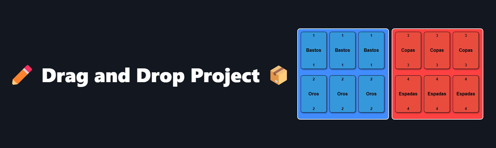
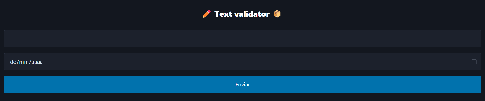

# Tareas del 1er trimestre DEC

Estas son las tareas que he hecho con en la asignatura de Desarrollo Entorno (DEC) Cliente con Raúl.

### Drag Color Zones

El programa Drag-And-Drop-Zones permite a los usuarios arrastrar y soltar cartas en diferentes zonas de una página web. Las cartas se generan dinámicamente y se distribuyen entre dos zonas de arrastre. Cada zona cambia de tamaño automáticamente para adaptarse al número de cartas que contiene. Además, las cartas tienen animaciones que se activan al ser arrastradas y soltadas.

### Formularios

El programa Formularios permite a los usuarios completar y enviar formularios en una página web. Los formularios incluyen validaciones en tiempo real para asegurar que los datos ingresados sean correctos antes de ser enviados. Además, se utilizan diferentes tipos de campos, como texto, correo electrónico, contraseñas y selectores, para proporcionar una experiencia de usuario completa y funcional. Los datos enviados se procesan y se muestran en una página de confirmación.

